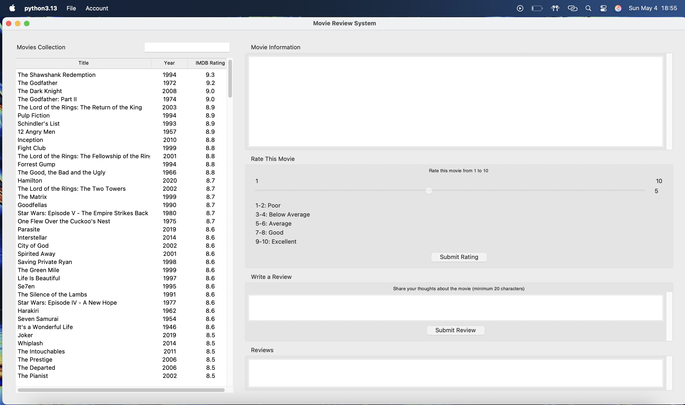

# MTIP: Movie Review System - User Manual

## Table of Contents

1.  [Introduction](#introduction)
2.  [Prerequisites](#prerequisites)
3.  [Getting Started](#getting-started)
4.  [Main Application Window](#main-application-window)
    *   [Movie List Pane (Left)](#movie-list-pane-left)
    *   [Movie Details Pane (Right)](#movie-details-pane-right)
5.  [Core Features](#core-features)
    *   [Browsing Movies](#browsing-movies)
    *   [Searching for Movies](#searching-for-movies)
    *   [Viewing Movie Details](#viewing-movie-details)
    *   [User Accounts](#user-accounts)
        *   [Registering a New Account](#registering-a-new-account)
        *   [Logging In](#logging-in)
        *   [Logging Out](#logging-out)
    *   [Rating Movies](#rating-movies)
    *   [Writing and Viewing Reviews](#writing-and-viewing-reviews)
6.  [Error Messages](#error-messages)
7.  [Exiting the Application](#exiting-the-application)

---

## 1. Introduction

Welcome to MTIP (Modern Film Database and User Interaction Platform)! This desktop application allows you to:

*   Browse an extensive collection of movies.
*   View detailed information about each movie.
*   Rate movies on a scale of 1 to 10.
*   Write and read user reviews.

The application uses a local SQLite database to store movie data, user accounts, ratings, and reviews securely.

---

## 2. Prerequisites

*   **Python:** You need a working Python installation (version 3.10 recommended) to run the application.
*   **Required Libraries:** The application uses `pandas` and `bcrypt`. These might need to be installed if you are running from source and don't have them:
    ```bash
    pip install py_reqs.txt
    ```
*   **Movie Data File:** The application requires the `IMDB top 1000.csv` file to be present in the *same directory* as the Python scripts (`database.py`, `main.py`) the first time it runs. This file is used to initially populate the movie database.

---

## 3. Getting Started

1.  Ensure all prerequisites are met and the `IMDB top 1000.csv` file is in the correct location.
2.  Navigate to the application's directory in your terminal or command prompt.
3.  Run the main application file using Python:
    ```bash
    python main.py
    ```
4.  The main application window will appear. You will likely be prompted to log in first.

---

## 4. Main Application Window

The main window is divided into two main sections (panes), separated by a draggable divider:

*   **Left Pane:** Displays the list of movies.
*   **Right Pane:** Shows details, rating options, and reviews for the currently selected movie.


*(Main Window Screenshot)*

### Movie List Pane (Left)

*   **Movies Collection Title:** Indicates the purpose of this pane.
*   **Search Bar:** Located at the top right of this pane. Allows you to quickly find movies by title.
*   **Movie List:** A table displaying movies with columns for:
    *   `ID`: Internal database ID (hidden by default).
    *   `Title`: The title of the movie.
    *   `Year`: The release year of the movie.
    *   `IMDB Rating`: The movie's rating on IMDB.
*   **Scrollbars:** Vertical and horizontal scrollbars appear if the list is too long or wide to fit.

### Movie Details Pane (Right)

This pane displays information and interaction options for the movie selected in the left pane.

*   **Movie Information:** A read-only text area showing:
    *   Title, Release Year, Certificate, Runtime, Genre
    *   IMDB Rating, Average User Rating (calculated from user submissions)
    *   Overview/Synopsis
    *   Director(s), Stars
    *   Number of IMDB Votes, Gross Earnings
*   **Rate This Movie:** (Requires Login)
    *   A slider (`Scale`) to select a rating from 1 to 10.
    *   A label displaying the currently selected numerical rating.
    *   Descriptive labels for rating ranges (Poor, Average, Excellent, etc.).
    *   A `Submit Rating` button.
*   **Write a Review:** (Requires Login)
    *   A text box to type your review (minimum 20 characters).
    *   A `Submit Review` button.
*   **Reviews:** A read-only text area displaying reviews submitted by other users for the selected movie, ordered by newest first.

---

## 5. Core Features

### Browsing Movies

*   Simply scroll through the movie list in the left pane using the vertical scrollbar or your mouse wheel.
*   Click on any movie row in the list to select it.

### Searching for Movies

1.  Locate the search bar at the top right of the movie list pane.
2.  Click inside the search bar and start typing the title (or part of the title) of the movie you are looking for.
3.  The movie list will automatically filter in real-time to show only movies whose titles contain the text you entered (case-insensitive).
4.  To clear the search and see all movies again, simply delete the text from the search bar.
5.  Hover your mouse over the search bar for a helpful tooltip.

### Viewing Movie Details

1.  **Single Click:** Click once on a movie row in the left pane. The details for that movie will load into the right pane sections (Information, Rating, Reviews).
2.  **Double Click:** Double-click on a movie row in the left pane. A separate pop-up window will appear, displaying the core details (Title, Year, Overview, Cast, etc.) for that movie in a read-only format. Close this pop-up window when you are done viewing.

### User Accounts

User accounts are required to rate movies and submit reviews.

#### Registering a New Account

1.  If you don't have an account, click the `Register` button on the initial Login window. (If the main app is already open, you may need to access Login first via the `Account` menu).
2.  The **Register** window will appear.
3.  Enter your desired `Username` (must be at least 3 characters).
4.  Enter your desired `Password` (must be at least 6 characters).
5.  Enter the same password again in the `Confirm Password` field.
6.  Click the `Register` button.
7.  You will receive a message indicating success or failure (e.g., if the username already exists or passwords don't match).
8.  On success, the Register window will close, and you can now log in using your new credentials.

#### Logging In

1.  When the application starts, the **Login** window usually appears automatically. Alternatively, go to the main menu bar: `Account` -> `Login`.
2.  Enter your `Username`.
3.  Enter your `Password`.
4.  Click the `Login` button or press `Enter`.
5.  If successful, the Login window closes, the main application title bar will update to show your username, and the rating/review controls in the right pane will become active.
6.  If unsuccessful (invalid username/password), an error message will be displayed.

#### Logging Out

1.  Ensure you are logged in.
2.  Go to the main menu bar: `Account` -> `Logout`.
3.  You will be logged out. The main application title bar will reset, and the rating/review controls will become disabled.
4.  The `Login` option in the `Account` menu will become active again, and `Logout` will be disabled.

### Rating Movies

1.  **Log in** to your account.
2.  Select the movie you want to rate from the list in the left pane.
3.  In the **Rate This Movie** section (right pane):
    *   Drag the slider handle or click on the scale to select your desired score (1-10). The number next to the scale updates instantly.
    *   Refer to the descriptions (Poor, Average, Good, etc.) if needed.
4.  Click the `Submit Rating` button.
5.  A confirmation message will appear.
6.  Your rating is saved. If you rate the same movie again, your previous rating will be updated. The "User Rating" display in the Movie Information section will also update based on the new average.

### Writing and Viewing Reviews

#### Writing a Review

1.  **Log in** to your account.
2.  Select the movie you want to review from the list in the left pane.
3.  In the **Write a Review** section (right pane):
    *   Click inside the text box.
    *   Type your review. **Your review must be at least 20 characters long.**
4.  Click the `Submit Review` button.
5.  A confirmation message will appear if successful. If your review is too short or if you have already reviewed this movie, an error message will be shown.
6.  Once submitted, your review will appear at the top of the **Reviews** section for that movie.
7.  You can only submit one review per movie per user. The text box will clear after successful submission.

#### Viewing Reviews

1.  Select any movie from the list in the left pane.
2.  Scroll down in the right pane to the **Reviews** section.
3.  All submitted reviews for that movie will be displayed, showing the username, timestamp, and the review text, with the newest reviews appearing first.
4.  If no reviews have been submitted, it will indicate "No reviews yet."

---

## 6. Error Messages

The application uses pop-up dialog boxes (message boxes) to display information, warnings, or errors. Examples include:

*   Login failures (incorrect password).
*   Registration errors (username taken, password mismatch, length requirements not met).
*   Trying to rate/review without logging in.
*   Review text being too short.
*   Database connection errors (less common, indicates a setup problem).

Read these messages carefully as they provide context for any issues encountered.

---

## 7. Exiting the Application

To close the MTIP application, you can either:

1.  Go to the main menu bar: `File` -> `Exit`.
2.  Click the standard close button (`X`) in the corner of the main application window.

---